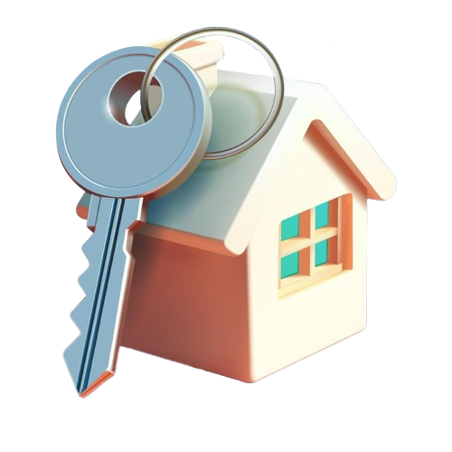

# _Home_Interface_

  

## Chi siamo?
Siamo il team Project-X, un gruppo di professionisti appassionati e altamente qualificati,  
impegnati a trasformare i sogni abitativi in realtà. La nostra missione è creare soluzioni innovative  
per la progettazione, la schematizzazione e la realizzazione di case domotiche, pensate per migliorare  
la qualità della vita di chi le abita. Ciò che ci distingue è il nostro approccio personalizzato:  
collaboriamo attivamente con i nostri clienti, grazie a un continuo scambio di idee e feedback, per creare   
ambienti che rispecchiano esattamente le loro necessità e desideri. Ogni progetto è costruito su misura,  
con un'attenzione particolare anche ai dettagli più piccoli, per garantire che la casa non sia solo funzionale,   
ma anche confortevole e in armonia con lo stile di vita di chi la vivrà.  

 

Non esitate a mettervi in contatto con noi per qualsiasi esigenza o domanda. Siamo qui per ascoltarvi e per  
aiutarvi a realizzare la casa dei vostri sogni.Se volete già dare un'occhiata al nostro primo progetto, potete  
farlo visitando il nostro sito al seguente link:  
  

<a href="https://lor1290.github.io/_Home_Intefrace_/" target="_blank">Home Interface</a>

## P.S.
Consigliamo, per gli utenti che vogliono aprire il nostro sito, di utilizzare il web-browser CHROME.  
Oltre a cio, e consigliato aspettare alcuni secondi (fino ad un massimo di un minuto) prima che i modelli  
3D presenti all'interno del nostro sito possano caricare completamente. Uno dei punti forti del nostro team è  
proprio il 3D, una esperienza unica con cui l'utente può immergersi all'interno della sua nuova casa.  
